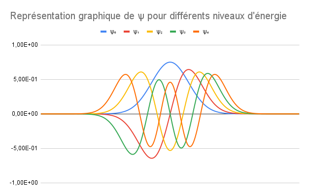

# Oscillateur harmonique quantique 1D

Projet scientifique

## Description

Le but de ce projet est de calculer les solutions de l'équation d'un oscillateur harmonique quantique 1D.

Avec ces solutions, on pourra également calculer les niveaux d'énergie pour l'équation de l'oscillateur harmonique Schrödinger 1D. On affichera tous ces résultats sous forme d'une graphe.

Ces solutions possèdent des propriétés qui seront également vérifiées, potentiellement par des tests unitaires.

Ci joint un exemple de tracé avec excel de la partie réelle des fonctions d'onde en fonction de la longueur considérée en argument.

## Commandes make

-Pour compiler l'exécutable, utilisez <code>make</code>.

-Pour lancer les tests, utilisez <code>make runtests</code> qui se chargera d'utiliser le makefile du dossier tests/.

-Pour générer la documentation, utilisez <code>make docs</code> qui est équivalent à <code>doxygen Doxygen</code>.

-Pour formater le code selon le astyle, utilisez <code>make format</code>.

-Pour clean les dossiers obj, astyle, ou de tests, utilisez <code>make clean</code> dans le bon dossier.

## Dossiers

-docs => Pour la génération de docs style doxygen

-headers => Pour les fichiers *.h

-obj => Pour les fichiers *.o

-src => Pour les fichiers *.cpp

-target => Dossier qui contient les exécutables, les fichiers à la fin de la chaîne de compilation

-tests => Pour les tests

## Pour compiler sans avoir à installer armadillo (déjà pris en chage par le makefile)

Ajouter le flag à g++ : -I "./armadillo/include"
